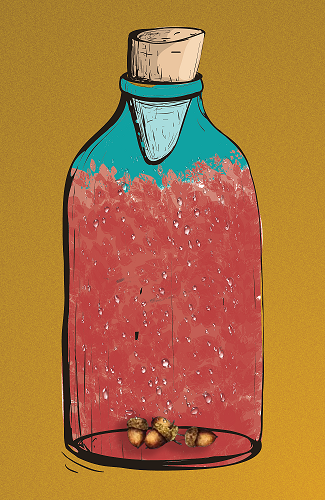

# 🐯 Structure of NFT in ERA1

NFT structure always starts with an empty bottle. In every bottle there must be a base element, SPRING water. Each bottle will have its own attribute, for example - cold, dusty and other. In the bottle, there is a unique blended carefully selected Scents. Also, each bottle has its own scent volume. The greater volume the rarer. Total 5000 NFT will be available to mint. All ERA1 NFT is marked with GENESIS attribute.


There are 3 main Scent notes in ERA1, and lots of traits for a unique NFT.




Base Scent element



Jasmine

Sage



Oakmoss

Acorn



Cucumber

Pine

Larch



Musk

Scorpion



| Volume of Scent | Possibility                                                     |
| :-------------: | --------------------------------------------------------------- |
|      100 ml     | <mark style="background-color:orange;">Unique</mark>            |
|      70ml       | <mark style="background-color:blue;">Rare</mark>                |
|       50ml      | <mark style="color:green;background-color:green;">Commom</mark> |

Three types of NFT will be available. ERA1 Scent bottle (Genesis), <mark style="color:green;">LaNd</mark> and ERA2 Empty bottle. These NFT will create and opportunity to gather <mark style="color:blue;">SPRING</mark> water token from the <mark style="color:green;">LaNd</mark>, collect it and then sell it to the <mark style="color:blue;">SPRING</mark> pool.

<figure><figcaption>
ERA1 Scent bottle
</figcaption></figure>
