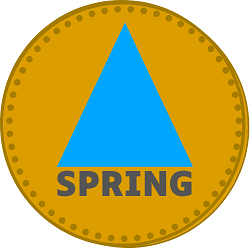

# 🐨 Tokenomics

<figure><figcaption>
SPRING token
</figcaption></figure>

## Game token - SPRING

* TOKEN – SOLANA CHAIN
* Name: Spring Water
* Symbol: <mark style="color:blue;">SPRING</mark>
* Total supply: 120 000 000 SPRING
* 1 <mark style="color:blue;">SPRING</mark> token = 1 ml of Spring water.

## Token distribution

|                                | Share |
| ------------------------------ | ----- |
| Team                           | 5 %   |
| Partnership                    | 15%   |
| Game Incentives                | 15%   |
| Airdrop                        | 5%    |
| Listing and Liquid SPRING pool | 40 %  |
